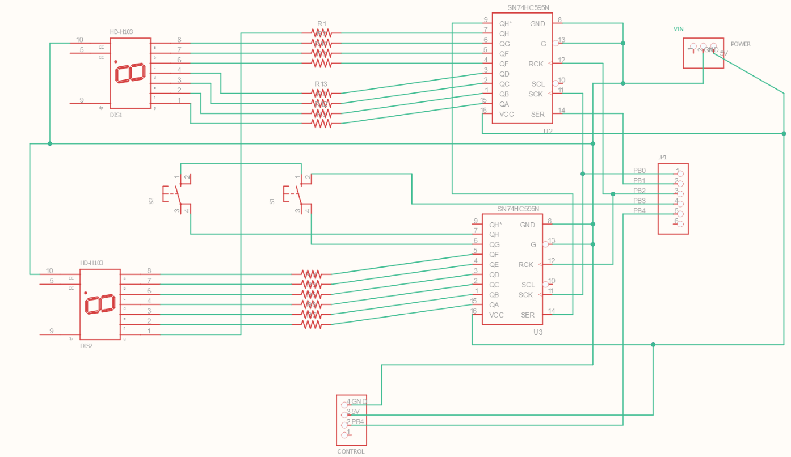

# GenericTimer

A simple timer for powering any device. Very useful for garden projects e.g. scheduling water system.

The microcontroller used is an attiny85 which is a perfect candidadte because it's very cheap and has enough power for this application. The code can be easily updated for a different one.

The arduino code also contains wrappers for the objects and constants specific to arduino libraries in order for it to compile in VC++. Using this method the code can be tested locally and compiled normally in C++.

The board requires a few components:
* Two 7-segment displays
* The corresponding resistors for powering the segments
* Two push-buttons for controlling and setting the time
* Two shift registers (serial IN - Parallel OUT): 74HC595 for extending the pin capability of the attiny85

## Schematic

## Control - Button behaviour

The timer provides control to two time-variables: the ON state and OFF state, meaning for how long it will activate the attached device (staying ON) and the dead interval between the activations (OFF time). This sequence repeats till powered off.

All changes made to the two variables are saved in the eeprom and thus are impervious to poweroffs.

	TIMER WORK:  how much time spent on doing work
	TIMER DELAY: how much time spent between delays
	
	BTN1 click      ->  increments TIMER WORK
	BTN1 dbl click  ->  decrement TIMER WORK
	BTN1+BTN2 clicks: switch to other state(TIMER WORK or TIMER DELAY)
	BTN2 click: does the work until pressed again. Resets TIMER DELAY 
